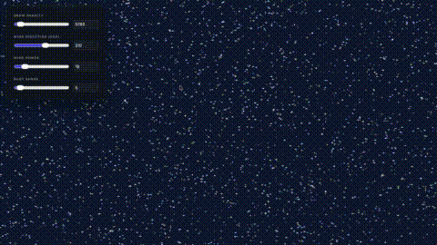

# WebGPU Lab ⚛

My playground for learning and experimenting with WebGPU. 

## Projects

### 2D Snowfall Simulation

Simulation up to 100,000 snowflakes with mouse interaction. Entirely calculated on GPU.

  
Demo

  
  

[Live Demo](https://sanderbay.github.io/webgpu-lab/2d_snowfall_simulation/index.html)